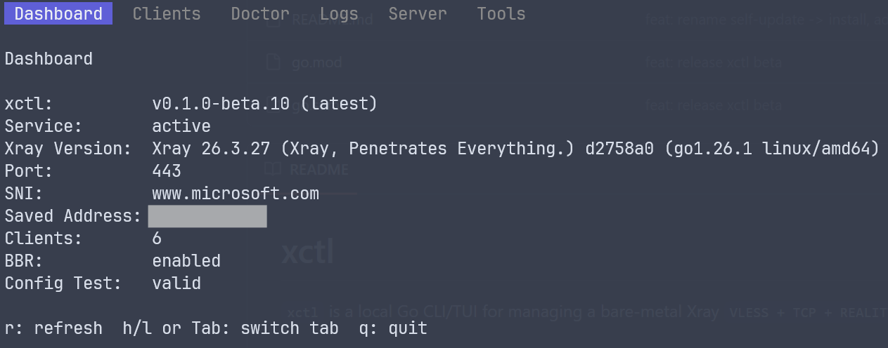

# xctl

`xctl` is a local Go CLI/TUI for managing a bare-metal Xray `VLESS + TCP + REALITY + Vision` node over SSH.



## Install

Installs `xctl` to `/usr/local/bin/xctl`:

```bash
curl -fsSL https://raw.githubusercontent.com/papasaidfine/xray-fast-deploy/main/scripts/install.sh | sudo bash
```

`xctl` reads and writes root-owned Xray files (`/usr/local/etc/xray/config.json`, `/root/.xray-reality/server.info`) and calls `systemctl restart xray`, so every command except `xctl version` needs `sudo`.

## First-time setup

On a fresh VPS:

```bash
sudo xctl init                                          # installs Xray if missing, generates config, restarts
sudo xctl init --sni www.apple.com --port 443 --name phone   # explicit options
```

`init` prints the initial VLESS link. Defaults: SNI `www.microsoft.com`, port `443`, client name `default`. It refuses to overwrite an existing config unless you pass `--force`.

## TUI

```bash
sudo xctl                          # opens the TUI by default
sudo xctl tui                      # same thing
```

Keybindings:

- `Tab` / `←` `→` / `h` `l` — switch tabs (vim-style hjkl supported)
- `↑` `↓` / `j` `k` — move cursor on the Clients tab; `g`/`G` jump to top/bottom
- Clients tab: `a` add, `d` delete, `R` rename, `u` reset UUID, `s` show VLESS link with QR, `r` refresh
- Server tab: `p` port, `D` disguise domain, `A` saved address, `t` test config, `X` restart xray, `r` refresh
- Tools tab: `b` toggle BBR, `f` toggle IP forwarding, `w` toggle firewall, `P` fix config perms, `r` refresh
- `Esc` cancels input/confirm prompts; `q` or `Ctrl+C` quits

## CLI

```bash
sudo xctl status
sudo xctl doctor
sudo xctl list-clients
sudo xctl add-client --name phone
sudo xctl remove-client --name phone
sudo xctl rename-client --name phone --new-name tablet
sudo xctl reset-uuid --name tablet
sudo xctl show-client --name tablet --qr               # link + scannable QR
sudo xctl export --qr                                  # all clients
sudo xctl change-port --port 8443
sudo xctl change-disguise --domain www.apple.com
sudo xctl server-address --address vpn.example.com
sudo xctl test
sudo xctl restart
sudo xctl logs --lines 50
sudo xctl logs -f                                      # follow (tail -f)
```

Run `xctl --help` for the full command list with descriptions.

## System tweaks

xctl wraps the common system-level fixes so you don't have to remember the commands:

```bash
sudo xctl bbr enable | disable | status                # persistent BBR + fq qdisc
sudo xctl forward enable | disable | status            # net.ipv4.ip_forward
sudo xctl firewall open | close | status [--port N]    # auto-detects ufw/firewalld/iptables
sudo xctl fix-perms                                    # restore <xray-user>:<group> 0644 on config

xctl version                                           # check current vs. latest release
sudo xctl install                                      # update xctl itself
sudo xctl xray-update                                  # update Xray via the official XTLS installer
```

## Doctor

`xctl doctor` prints `ok` / `warn` / `fail` for each check with a short repair hint:

- Xray binary, service, config file, `xray -test`, listening port
- Local firewall (`ufw` / `firewalld` / `iptables`)
- BBR congestion control, default qdisc, `tcp_bbr` module
- Saved server address vs. detected public IPv4
- Recent service errors from `journalctl`
- Disk space for logs, system time sanity, IP forwarding

Disabled IP forwarding is normal for VLESS-only mode. Cloud security groups (AWS / GCP / Oracle / etc.) cannot be seen from inside the VPS — check the provider's console if the port is open locally but still unreachable.

## After a VPS IP change

```bash
sudo xctl server-address --address vpn.example.com
sudo xctl export
```

## Cheatsheet

[`docs/cheatsheet.md`](docs/cheatsheet.md) has copy-pasteable manual equivalents for everything `xctl` automates (raw `sysctl`, `ufw`, `firewalld`, `iptables`, `journalctl` commands), plus a few extras (NTP, disk vacuuming).

## Safety

All config-changing operations write a temporary candidate, run `xray -test` against it, and atomically replace the active config before restarting Xray. If the test fails, the live config is left untouched and the service is not restarted.
